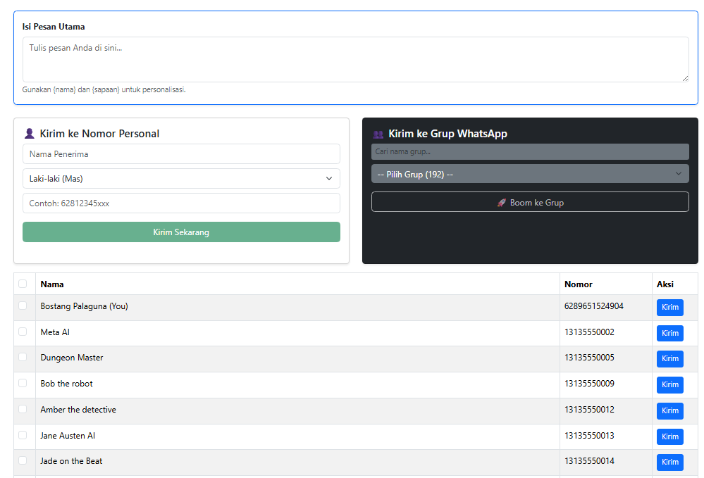
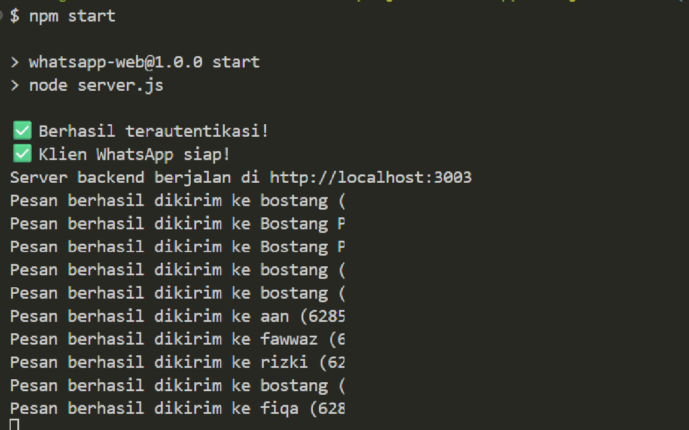

# 🚀 WhatsApp Web Sender v2.2

Aplikasi web otomatisasi WhatsApp yang cepat, ringan, dan teroptimasi. Dibangun menggunakan arsitektur modern untuk memastikan pengalaman pengguna yang mulus tanpa *lagging* saat pengiriman pesan massal maupun manajemen kontak.

**Tampilan Frontend**:


**Tampilan Backend**:


## ✨ Fitur Unggulan (v2.2)

- **High-Performance UI**: Dioptimasi dengan `React.memo`, `useCallback`, dan `useRef` untuk memastikan pengetikan pesan tetap responsif (Zero-Lag) meskipun mengelola ratusan kontak.
- **Advanced Filtering**: Fitur pencarian *real-time* untuk Kontak dan Grup WhatsApp secara terpisah.
- **Smart Messaging**:
  - **Bulk Send**: Kirim pesan massal ke kontak terpilih dengan satu klik.
  - **Group Sender**: Kirim pesan pengumuman ke grup WhatsApp langsung dari dashboard.
  - **Personal Custom Sender**: Kirim ke nomor manual tanpa simpan kontak.
- **Dynamic Personalization**: Dukungan variabel `{nama}` dan `{sapaan}` (Mas/Mbak) berdasarkan gender untuk pesan yang lebih manusiawi.
- **Reliable Backend**: Menggunakan `whatsapp-web.js` yang stabil dengan sistem log otentikasi di terminal.

## 🛠️ Prasyarat

- **Node.js**: v16.x atau lebih tinggi
- **WhatsApp**: Akun aktif untuk proses *pairing* via QR Code

## 🚀 Cara Menjalankan

1. **Clone Repositori**

   ```bash
   git clone [https://github.com/bostang/whatsapp-web-js](https://github.com/bostang/whatsapp-web-js)
   cd whatsapp-web-js

```

2. **Setup Backend**
```bash
cd backend
npm install
node server.js

```

*Scan QR Code di terminal dan tunggu hingga muncul status `Berhasil terautentikasi!`.*
3. **Setup Frontend**

```bash
# Buka terminal baru
cd frontend
npm install
npm start

```

*Aplikasi akan berjalan otomatis di `http://localhost:3000`.*

## 📂 Struktur Proyek

```text
├── backend/
│   ├── server.js       # Express server & Logic WhatsApp
│   ├── groups.json     # Database daftar grup
│   └── contacts.json   # Database daftar kontak
├── frontend/
│   ├── src/
│   │   ├── components/ # Komponen teroptimasi (Table, Sender, Input)
│   │   ├── api.js      # Konfigurasi Axios & Endpoint
│   │   └── App.js      # Orchestrator utama (State management)
│   └── public/
└── README.md

```

## 📝 Catatan Penggunaan

- Gunakan format nomor internasional (contoh: `62812...`) tanpa spasi atau tanda plus.
- Pastikan koneksi internet di HP stabil saat proses pengiriman massal berlangsung untuk menghindari *delay*.

---

Dibuat dengan ❤️ untuk efisiensi komunikasi.
